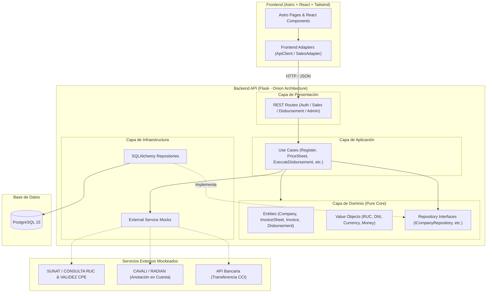

# Core de Factoring B2B - Monorepo Base

Este repositorio contiene la implementación del **Core de Factoring B2B** para el descuento de facturas comerciales electrónicas, diseñado para el curso de Arquitectura de Software de Tecsup.

La solución está construida utilizando patrones de **Onion Architecture** en el Backend y una arquitectura desacoplada basada en adaptadores en el Frontend.

---

## 1. Arquitectura del Sistema

El siguiente diagrama ilustra la arquitectura lógica del sistema, los componentes por capas y la simulación de integraciones externas (SUNAT, CAVALI / RADIAN, Transferencias Bancarias):



---

## 2. Estructura del Monorepo y Pruebas

```text
tecsup-arq-factoring/
├── back/
│   ├── src/
│   │   ├── domain/               # Entidades de dominio y Value Objects
│   │   ├── application/          # Casos de uso de negocio
│   │   ├── infrastructure/       # SQLAlchemy ORM, DB models y mocks externos
│   │   └── presentation/         # Rutas Flask REST y validación de endpoints
│   └── tests/
│       ├── unit/                 # Pruebas unitarias de dominio y casos de uso
│       ├── integration/          # Pruebas de integración de endpoints API
│       └── e2e/                  # Pruebas end-to-end completas de backend
├── front/
│   ├── src/
│   │   ├── adapters/             # Adaptadores de cliente API
│   │   ├── components/           # Componentes interactivos React
│   │   ├── pages/                # Vistas y rutas Astro (/dashboard, /sales/new, etc.)
│   │   └── styles/               # Estilos globales y TailwindCSS
├── db/                           # Dockerfile e inicialización de PostgreSQL
├── docker-compose.yml            # Orquestador de desarrollo local
└── README.md                     # Documentación general del proyecto
```

---

## 3. Puesta en Marcha en Entorno Local (Startup)

### Requisitos Previos
* [Docker](https://docs.docker.com/get-docker/) instalado y en ejecución.
* [Docker Compose](https://docs.docker.com/compose/install/) (incluido con Docker Desktop).

### Pasos para Ejecutar
1. **Clonar el repositorio:**
   ```bash
   git clone <repository_url>
   cd tecsup-arq-factoring
   ```

2. **Levantar los servicios con Docker Compose:**
   ```bash
   docker compose up --build
   ```

3. **Acceder a las aplicaciones:**
   * **Frontend Web (Astro):** [http://localhost:4321](http://localhost:4321)
   * **Backend REST API (Flask):** [http://localhost:8000](http://localhost:8000)
   * **Health Check API:** [http://localhost:8000/health](http://localhost:8000/health)

4. **Ejecutar Suite de Pruebas Backend:**
   ```bash
   ./back/.venv/bin/pytest back/tests
   ```

---

## 4. Variables de Entorno (`.env`)

A continuación se detallan las variables de entorno principales configuradas en el archivo `.env`:

| Variable | Descripción | Valor por Defecto |
| :--- | :--- | :--- |
| `POSTGRES_USER` | Usuario administrador de la base de datos PostgreSQL | `factoring_user` |
| `POSTGRES_PASSWORD` | Contraseña de acceso a PostgreSQL | `factoring_pass_2026` |
| `POSTGRES_DB` | Nombre de la base de datos principal | `factoring_core_db` |
| `POSTGRES_HOST` | Host o nombre del servicio Docker de la DB | `db` |
| `POSTGRES_PORT` | Puerto de conexión a PostgreSQL | `5432` |
| `SECRET_KEY` | Clave secreta para la aplicación Flask | `super-secret-factoring-key-2026` |
| `JWT_SECRET_KEY` | Clave para firmado y verificación de Tokens JWT | `jwt-secret-factoring-key-2026` |
| `PORT` | Puerto del servidor backend | `8000` |
| `PUBLIC_API_BASE_URL` | URL base consumida por el cliente frontend | `http://localhost:8000/api` |
