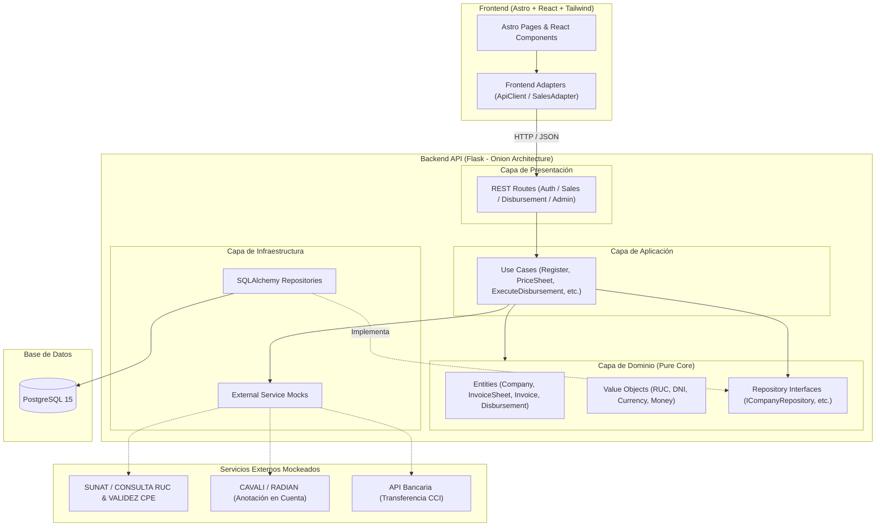

# Core de Factoring B2B - Monorepo Base

Este repositorio contiene la implementación del **Core de Factoring B2B** para el descuento de facturas comerciales electrónicas, diseñado para el curso de Arquitectura de Software de Tecsup.

La solución está construida utilizando patrones de **Onion Architecture** en el Backend y una arquitectura desacoplada basada en adaptadores en el Frontend.

---

## 1. Arquitectura del Sistema

El siguiente diagrama ilustra la arquitectura lógica del sistema, los componentes por capas y la simulación de integraciones externas (SUNAT, CAVALI / RADIAN, Transferencias Bancarias):



---

## 2. Estructura del Monorepo y Pruebas

```text
tecsup-arq-factoring/
├── back/
│   ├── src/
│   │   ├── domain/               # Entidades de dominio y Value Objects
│   │   ├── application/          # Casos de uso de negocio
│   │   ├── infrastructure/       # SQLAlchemy ORM, DB models y mocks externos
│   │   └── presentation/         # Rutas Flask REST y validación de endpoints
│   └── tests/
│       ├── unit/                 # Pruebas unitarias de dominio y casos de uso
│       ├── integration/          # Pruebas de integración de endpoints API
│       └── e2e/                  # Pruebas end-to-end completas de backend
├── front/
│   ├── src/
│   │   ├── adapters/             # Adaptadores de cliente API
│   │   ├── components/           # Componentes interactivos React
│   │   ├── pages/                # Vistas y rutas Astro (/dashboard, /sales/new, etc.)
│   │   └── styles/               # Estilos globales y TailwindCSS
├── db/                           # Dockerfile e inicialización de PostgreSQL
├── docker-compose.yml            # Orquestador de desarrollo local
└── README.md                     # Documentación general del proyecto
```

---

## 3. Puesta en Marcha en Entorno Local (Startup)

### Requisitos Previos
* [Docker](https://docs.docker.com/get-docker/) instalado y en ejecución.
* [Docker Compose](https://docs.docker.com/compose/install/) (incluido con Docker Desktop).

### Pasos para Ejecutar
1. **Clonar el repositorio:**
   ```bash
   git clone <repository_url>
   cd tecsup-arq-factoring
   ```

2. **Levantar los servicios con Docker Compose:**
   ```bash
   docker compose up --build
   ```

3. **Acceder a las aplicaciones:**
   * **Frontend Web (Astro):** [http://localhost:4321](http://localhost:4321)
   * **Backend REST API (Flask):** [http://localhost:8000](http://localhost:8000)
   * **Health Check API:** [http://localhost:8000/health](http://localhost:8000/health)

4. **Ejecutar Suite de Pruebas Backend:**
   ```bash
   ./back/.venv/bin/pytest back/tests
   ```

---

## 4. Variables de Entorno (`.env`)

A continuación se detallan las variables de entorno principales configuradas en el archivo `.env`:

| Variable | Descripción | Valor por Defecto |
| :--- | :--- | :--- |
| `POSTGRES_USER` | Usuario administrador de la base de datos PostgreSQL | `factoring_user` |
| `POSTGRES_PASSWORD` | Contraseña de acceso a PostgreSQL | `factoring_pass_2026` |
| `POSTGRES_DB` | Nombre de la base de datos principal | `factoring_core_db` |
| `POSTGRES_HOST` | Host o nombre del servicio Docker de la DB | `db` |
| `POSTGRES_PORT` | Puerto de conexión a PostgreSQL | `5432` |
| `SECRET_KEY` | Clave secreta para la aplicación Flask | `super-secret-factoring-key-2026` |
| `JWT_SECRET_KEY` | Clave para firmado y verificación de Tokens JWT | `jwt-secret-factoring-key-2026` |
| `PORT` | Puerto del servidor backend | `8000` |
| `PUBLIC_API_BASE_URL` | URL base consumida por el cliente frontend | `http://localhost:8000/api` |

---

## 5. Endpoints de la API

Prefijo base: `http://localhost:8000`. Autenticación vía header `Authorization: Bearer <JWT>`, obtenido en `/api/auth/login`.

### 5.1 Autenticación (`/api/auth`)

| Método y Ruta | Descripción de Alto Nivel | Reglas de Negocio Validadas |
| :--- | :--- | :--- |
| `POST /api/auth/register` | Registra al Representante Legal y, opcionalmente, su Empresa en un solo paso. Crea ambos registros en estado `PENDING_VERIFICATION`. | **RF06**: unicidad de email/DNI/RUC, formato válido de DNI/RUC/CCI (Value Objects), fuerza de contraseña. Dispara el mock de verificación RENIEC/SUNAT — si falla, el usuario pasa directo a `REJECTED`; si pasa, permanece `PENDING_VERIFICATION` para revisión manual del admin. |
| `POST /api/auth/login` | Autentica por email o DNI + contraseña, retorna JWT y registra intento de sesión. | Bloqueo de cuenta tras 5 intentos fallidos consecutivos (`AccountLockedException`), rechazo de usuarios inactivos. |
| `POST /api/auth/logout` | Invalida la sesión/token actual. | Requiere token válido vigente. |
| `GET /api/auth/me` | Retorna el perfil del usuario autenticado y su empresa asociada (si tiene). | Requiere JWT válido; expone `verification_status` para que el frontend decida si redirige a `/verification-pending`. |

### 5.2 Onboarding y Administración (`/api/v1`)

| Método y Ruta | Descripción de Alto Nivel | Reglas de Negocio Validadas |
| :--- | :--- | :--- |
| `POST /api/v1/onboarding/documents` | Sube documentación de sustento legal/tributario de la empresa (Ficha RUC, Vigencia de Poder). | **RF06** (paso 3): asocia el documento a la empresa del usuario autenticado; requiere sesión activa. |
| `GET /api/v1/admin/companies/pending` | Lista todas las empresas en `PENDING_VERIFICATION`, con sus documentos adjuntos, para la bandeja del Administrador. | **RF06** (paso 7): expone el expediente completo (RUC, banco, CCI, documentos) para la revisión manual. |
| `POST /api/v1/admin/companies/<company_id>/verify` | Aprueba o rechaza manualmente la verificación de una empresa (`{"approve": true/false}`). | **RF06**: transición explícita de estado `PENDING_VERIFICATION` → `APPROVED` o `REJECTED`, única vía legítima de aprobación tras el fix de auto-aprobación. |

### 5.3 Planillas y Cotización (`/api/v1/sales`)

| Método y Ruta | Descripción de Alto Nivel | Reglas de Negocio Validadas |
| :--- | :--- | :--- |
| `POST /sales/sheets` | Registra manualmente una planilla de facturas y ejecuta la cotización automática (SUNAT mock + pricing). | **RF01**: tamaño de lote (**BR02**, 1-90 documentos); **RF02**: validación SUNAT mock por factura; **BR01**: plazo máx. 180 días al vencimiento; **BR03**: rechazo si Girador y Aceptante comparten grupo económico; **RF04**: cálculo de tasa/comisión/neto vía `IPricingService`. |
| `GET /sales/sheets/<sheet_id>` | Obtiene el detalle de una planilla, incluyendo el desglose de facturas evaluadas y su estado individual. | Requiere empresa verificada (`require_verified_company`). |
| `GET /sales/sheets` | Lista todas las planillas de la empresa del usuario autenticado. | Requiere empresa verificada; filtra por `company_id` del usuario. |
| `POST /sales/sheets/upload-batch` | Igual que la creación manual, pero recibe un archivo CSV/JSON con el lote completo de facturas. | Mismas reglas que `POST /sales/sheets` (**RF01, RF02, BR01, BR02, BR03, RF04**), aplicadas al lote parseado del archivo. |
| `GET /sales/files/<file_type>/<filename>` | Sirve archivos previamente subidos (documentos/lotes). | Requiere sesión activa. |
| `POST /sales/sheets/<sheet_id>/negotiate` | El cliente solicita una tasa distinta a la cotizada originalmente. | **RF07**: registra una propuesta de negociación asociada a la planilla, sin alterar el pricing hasta que se responda. |
| `POST /sales/sheets/<sheet_id>/respond-negotiation` | Acepta, contra-oferta o rechaza una negociación de tasa en curso (o rechaza la planilla directamente si no hay negociación activa). | **RF07 / BR04**: si se acepta, recalcula pricing con la tasa final y marca la planilla `APPROVED`/`COUNTER_OFFERED`; si se rechaza, pasa a `REJECTED`. *(Nota: hoy expuesto a cualquier empresa verificada, sin distinción de rol Admin/Ejecutivo — pendiente de reforzar autorización).* |

### 5.4 Desembolsos (`/api/v1`)

| Método y Ruta | Descripción de Alto Nivel | Reglas de Negocio Validadas |
| :--- | :--- | :--- |
| `POST /sales/sheets/<sheet_id>/accept` | El Girador acepta la cotización final y dispara la ejecución del desembolso. | **RF05**: anotación preventiva de la planilla (**BR05**, previene doble descuento) y transición a `DISBURSED`; requiere empresa verificada. |
| `GET /disbursements/<disbursement_id>` | Consulta el detalle de un desembolso ejecutado (monto, cuenta, CCI, fecha). | Requiere empresa verificada. |
| `GET /disbursements` | Lista todos los desembolsos históricos de la empresa del usuario autenticado. | Requiere empresa verificada; filtra por `company_id`. |

### 5.5 Utilitario

| Método y Ruta | Descripción de Alto Nivel |
| :--- | :--- |
| `GET /health` | Health check simple, sin autenticación, usado por Docker/orquestación. |

