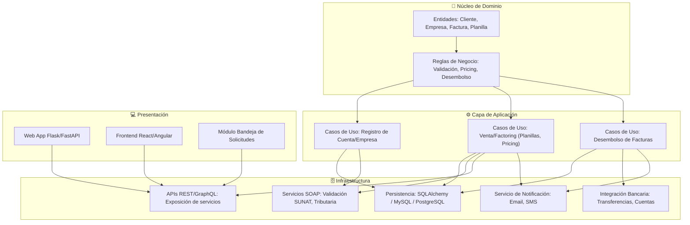
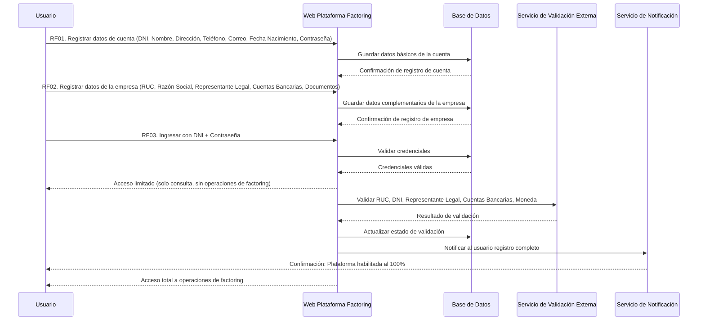
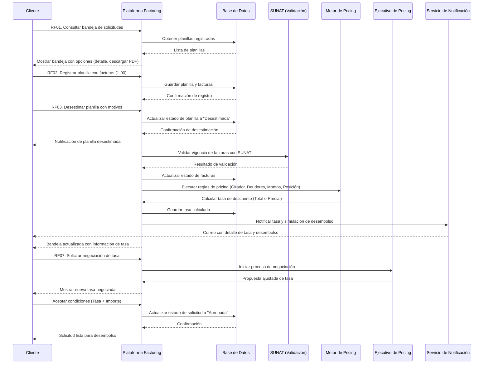
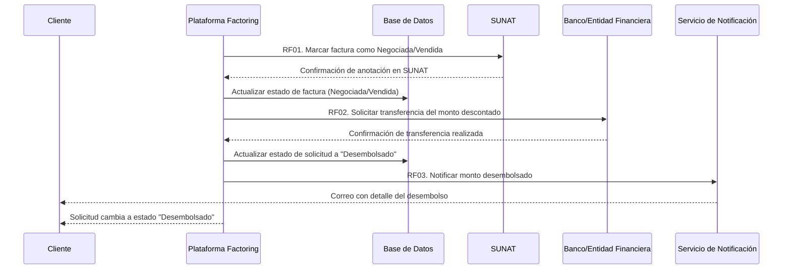

# Proyecto Factoring
### 🧅 Cómo encaja Onion en un sistema de Factoring


### 1. Dominio (Núcleo)
* Reglas de negocio del factoring:
  * Cálculo de tasas de descuento.  
  * Validación de vencimientos de letras/facturas.  
  * Determinación del riesgo crediticio.  
  * Generación de contratos y obligaciones.

Este núcleo no depende de frameworks ni bases de datos, solo de entidades y lógica pura.

### 2. Capa de Aplicación
* Casos de uso:
  * Registrar una factura para descuento.  
  * Calcular el valor presente neto.  
  * Aprobar o rechazar una operación según políticas.  

Aquí se orquesta la interacción entre dominio e infraestructura.

### 3. Infraestructura
* Adaptadores: 
  * Persistencia: ORM con SQLAlchemy o Django ORM.  
  * Servicios externos: APIs de bancos, SUNAT (en Perú), SOAP/REST para validación tributaria.  
  * Interfaces: REST/GraphQL para exponer servicios a clientes.

### 4. Presentación
* Frontend web o móvil que consume las APIs.
* Puede cambiarse sin afectar el núcleo de negocio.

### 📊 Beneficios de usar Onion en Factoring
* **Aislamiento del núcleo financiero:** las reglas de descuento y validación no dependen de la base de datos ni del framework.

* **Flexibilidad tecnológica:** puedes cambiar de Flask a FastAPI, o de MySQL a PostgreSQL sin tocar el dominio.

* **Escalabilidad:** fácil integración con brokers de mensajería (RabbitMQ, Kafka) para procesar grandes volúmenes de facturas.

* **Seguridad:** el núcleo protege las reglas críticas de negocio frente a cambios externos.


 ## Diagrama de capas Onion: Registro, Venta y Desembolso

* Dominio:
  *  Entidades principales: Cliente, Empresa, Factura, Planilla.
  *  Reglas de negocio: validación de datos, cálculo de tasas de descuento, control de desembolsos.

* Aplicación:
  * Casos de uso organizados por módulo:
    * Registro (cuenta y empresa).
    * Venta (planillas, pricing, negociación).
    * Desembolso (transferencia y notificación).

* Infraestructura:
  * Persistencia con ORM y DB.
  * Integraciones externas: SUNAT (SOAP), APIs REST, bancos, notificaciones.

* Presentación:
  * Interfaces web y móviles.
  * Bandeja de solicitudes para gestión del cliente.


## 📊 Diagrama de Capas


## Requerimientos funcionales del módulo “Registro”
RF01 y RF02: El usuario registra primero sus datos personales y luego los de la empresa.

RF03: Puede ingresar a la plataforma, pero con acceso limitado hasta que se validen los datos.

RF04: Se realiza la validación con servicios externos (RUC, cuentas bancarias, representante legal).

RF05: Una vez confirmada la validación, se notifica al usuario y se habilita el acceso completo.

## 📊 Diagrama de Secuencia “Registro”



## Requerimientos funcionales del módulo “Venta”
RF01–RF03: El cliente gestiona sus planillas (consulta, registro, desestimación).

RF04–RF05: La plataforma valida las facturas con SUNAT y ejecuta reglas de pricing.

RF06: Se notifica al cliente la tasa y simulación de desembolso.

RF07: El cliente puede negociar la tasa con un ejecutivo y finalmente aprobarla para el desembolso.

## 📊 Diagrama de Secuencia “Venta”


## Requerimientos funcionales del módulo “Desembolso”
RF01: La plataforma marca la factura como negociada en SUNAT para evitar duplicidad de operaciones.

RF02: Se realiza la transferencia del monto descontado a la cuenta del cliente.

RF03: Se notifica al cliente que el desembolso fue realizado y la solicitud cambia de estado.

## 📊 Diagrama de Secuencia “Desembolso”

  
  

# Core de Factoring - Monorepo Base

Este proyecto consiste en el desarrollo del módulo **Core de Factoring** para una plataforma de descuento de facturas comerciales y letras de cambio, diseñado para el curso de Arquitectura de Software de Tecsup.

El monorepo está estructurado utilizando patrones de diseño de arquitectura limpia: **Onion Architecture** para el backend y una arquitectura desacoplada en el frontend.

---

## 1. Arquitectura del Proyecto

### Backend (`/back`)
Implementa **Onion Architecture** (Arquitectura de Cebolla) en Flask y Python 3.11:
*   **Domain:** Contiene las entidades puras y las interfaces abstractas de repositorios. Sin dependencias externas.
*   **Application:** Alberga los casos de uso principales de la lógica de negocio y las abstracciones de servicios externos.
*   **Infrastructure:** Implementaciones de base de datos (PostgreSQL), clientes externos y contenedor de inyección de dependencias.
*   **Presentation:** API REST implementada con Flask y validación estricta de requests/responses mediante Pydantic v2.

### Frontend (`/front`)
Implementa una arquitectura limpia desacoplada utilizando **Astro + TailwindCSS** con componentes interactivos específicos en **React**:
*   **Domain:** Interfaces de entidades de negocio puras.
*   **Application:** Casos de uso de lógica de negocio y flujo en la interfaz del cliente.
*   **Adapters:** Clientes de API, DTOs y Mapeadores que traducen las estructuras del backend para aislar al frontend de cambios en la API.
*   **UI Components:** Páginas nativas en Astro (renderizado estático de alta performance) e hidratación interactiva de componentes React.

---

## 2. Estructura del Monorepo

```
tecsup-arq-factoring/
├── back/               # Aplicación Backend en Flask (Python 3.11 + uv)
├── db/                 # Configuración de base de datos PostgreSQL 15
├── front/              # Aplicación Frontend en Astro + TailwindCSS + React
├── db_data/            # Datos persistidos de base de datos local (Ignorado en Git)
├── README.md           # Este archivo (Guía para humanos)
├── docker-compose.yml  # Orquestador del entorno de desarrollo local
└── .pre-commit-config.yaml # Configuración de linters automáticos
```

---

## 3. Requisitos Previos

Antes de ejecutar el proyecto, asegúrese de tener instalado:
*   [Docker](https://docs.docker.com/get-docker/)
*   [Docker Compose](https://docs.docker.com/compose/install/)
*   [pre-commit](https://pre-commit.com/) (opcional, para desarrollo local)

---

## 4. Cómo Iniciar el Entorno de Desarrollo

### Docker Compose
Para levantar todos los contenedores (Frontend, Backend y Base de datos) en tu máquina local con recarga en caliente habilitada para el front, ejecuta el siguiente comando en la raíz del repositorio:

```bash
docker compose up --build
```

Una vez que los servicios estén corriendo, podrás acceder a:
*   **Frontend (Astro):** [http://localhost:4321](http://localhost:4321)
*   **Backend API (Flask):** [http://localhost:8000](http://localhost:8000)
*   **Servicio de salud (Health check):** [http://localhost:8000/health](http://localhost:8000/health)

---

## 5. Control de Calidad (Linters y Formateadores)
El proyecto utiliza un sistema de linters locales orquestado por `pre-commit`. Se ejecutan automáticamente al realizar un commit o manualmente con:

```bash
pre-commit run --all-files
```

*   **Backend:** Ruff (linter y formateador ultrarrápido) y Mypy (chequeo de tipos estáticos estrictos).
*   **Frontend:** Prettier (formateador con ordenamiento automático de clases de Tailwind) y ESLint v9 plano (con soporte de TypeScript y Astro).
*   **Idioma de Desarrollo:** Todo el código fuente, docstrings, comentarios y nombres de archivos se desarrollan estrictamente en **inglés**.
